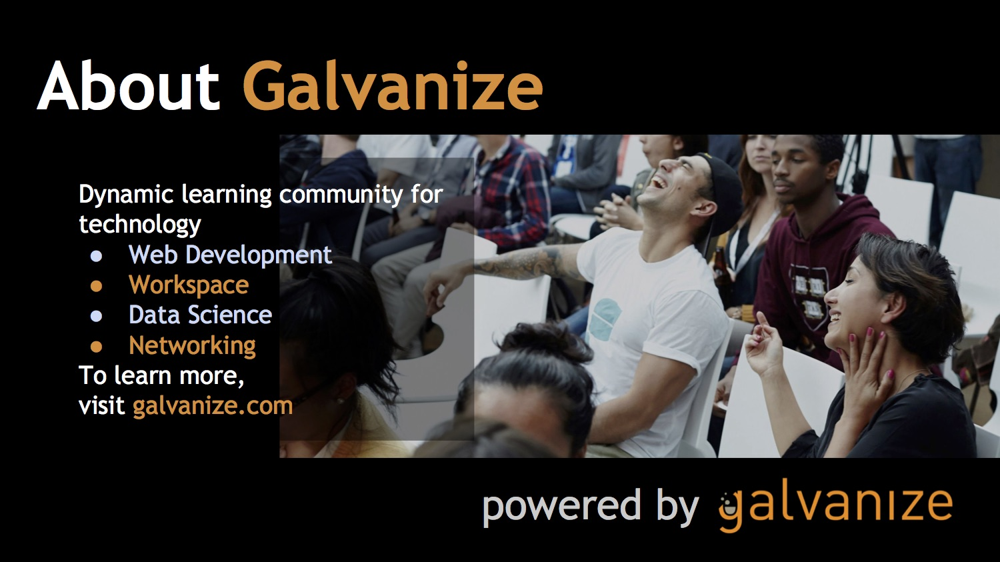

# Learn to Code HTML & CSS
Brought to you by Galvanize. Learn more about the way we teach code at [galvanize.com](http://galvanize.com).



## Overview
The goal of this brief course is to provide you with a fun introduction to the world of web development, starting with HTML and CSS.

#### Here's what we'll be doing:
* Setting up our computers for web development
* Overview of basic HTML concepts
* Overview of CSS concepts
* Playing around in the sandbox

#### Before you begin, a quick gut check:
* This course is for absolute beginners
* Feel free to move ahead
* Help others when you can
* Be patient and nice
* You will get through it!

#### What web coding is (really)?
Recipes to give to your computer to “cook” up some awesome things for you online

## Setting up your computer
(Brace yourself...)

#### Please set up the following:
* A web browser to see what we're working on as others see it (Recommend Google Chrome: [chrome.google.com](http://chrome.google.com))
* A text editor to modify your files (Recommend the Atom text editor: [Atom.io](http://atom.io))

#### Download the files for this class:
1. Go to https://github.com/GalvanizeOpenSource/Learn-To-Code-HTML-CSS
2. Click on the button on the right-hand side that says "Download ZIP"
3. Go to your downloads folder and double click on the .zip file to unzip it
4. IMPORTANT! Leave all the individual files in the downloaded folder (if you would like to move it out of the downloads folder move the entire folder, not individual items)
5. From Atom: File > open, select the folder and then click "Open"
6. From Atom: If the file tree does not appear on the left hand View > Toggle Tree View -- this will show you the entire folder within Atom (or `Cmd + \` on OSX )
7. Feel free to poke around in the files (`index.html` and `style.css` are the two files we will be using.)
8. Open `index.html` in your browser. (In chrome select: "File" > "Open File..." > find the downloaded project folder and select `index.html` )

Patience! Setting up your computer takes time and can be tricky, especially across platforms.

Once you're ready, you can move onto the next lesson.

## HTML - "the building blocks of the internet"

Hyper Text Markup Language, or HTML, is the most elemental language of the internet. Everything you see within your web browser is an interpretation of HTML in some form of other, and it is essential to learn in all web development.

###### HTML is made up of blocks called *elements*
Each element has 3 pieces:
* `Content` - the text you want visible on the page
* `<Tag>` - code that wraps around the content of an element to designate a particular effect, sometimes inherent to the tag.
* `Attributes="value"` - optional extra information about an element that is not displayed on the page.


Example:

```
<p id='p1'>This is a paragraph.</p>
```

#### HTML Tags:
Tags are used to mark up the beginning and end of an HTML element.

Almost everything in HTML needs to start and end with a tag. In between the opening and closing tags you can put text content or even other tags!

- like this: `<div>Hello!</div>`
- or even this: `<div> <p>paragraph text</p> </div>`
- *Note: not every element has a closing tag!*

###### Common Tags:
- `<html></html>` designates document as HTML
- `<div></div>` notes a block element in the page
- `<a></a>` anchor, activates a link in the page
- `<head></head>` contains meta information
- `<body></body>` contains browser information
- `<h1></h1>` notes a heading of the largest size
- and many more... (https://developer.mozilla.org/en-US/docs/Web/HTML/Element)

###### Irregular Tags:
- `` creates an image in the page
- `<br />` creates a line break in the page
- `<hr />` creates a horizontal line
- `<link />` connects html to related documents (usually stylesheets)
- `<input />` creates an input field

#### HTML Attributes:
HTML attributes contain extra information about the element which you don't want to appear in the actual content.

Attributes are generally defined as name-value pairs:


more detailed info: https://developer.mozilla.org/en-US/docs/Learn/HTML/Introduction_to_HTML/Getting_started#Attributes

###### The most common attributes are:
- `id=""` - used to identify an element (The same id can only be used once)
- `class=""` - Sets the CSS class/s of an element. The same class can be used on multiple elements.
- `href=""` - hyperlink reference to an internal or external link
- `src=""` - source file to an image, video, etc.
- `style=""` - add some color, font, margins, etc.
- ^ *There’s a MUCH better way to do this via CSS - more on that later!*

How do we check whether elements are showing up in the browser? Use the **inspect element** feature!

## LET'S CODE!

###### Remember:
- Coding can be hard - be patient!
- Work in pairs! Even the pros do it
- Ask for help - we’re in a school!

#### Let's get started!
1. Open up your text editor
2. Navigate to your repo
3. Open up the following files
- index.html
- CSS/style.css

### Challenge
- Add an `<h1>` tag to your page with a unique title!
- If you're feeling ambition try changing the `<title>` with a custom title all your own.

## Overview of CSS

What Does CSS Stand for?
- Cascading - prioritizing certain values over others
- Style - focusing on layout, colors, fonts, etc.
- Sheet - another name for the file we use here

The internet used to be ugly. Enter CSS - a consolidated way to make it prettier.

CSS looks like this:


The three main parts include:
* `selector` - tells CSS which element to style using html tag, id or class.
* `property` - which style property to change
* `value` - the result value to use for the chosen property

#### CSS Selectors:
- Tag: effects all h1, div, body, a elements on the page
	- `div {...}`
- IDs: effects the element with corresponding ID
	- `#myId {...}`
- Classes: effects all elements with the specified class
	- `.className {...}`

Example CSS Code:

```
h1 {  // this is either an element, class, or ID
	font-size: 24px; // syntax is name: value;
	font-weight: bold;
	color: #000000; // hexadecimal, RGB, etc.
}
```

#### What are IDs?
IDs are attributes that are used only on one element ONLY and noted with a “#” symbol in CSS
e.g.
```
HTML:
<a id=”myId”>Scott Hurlow</a>

CSS:
#myId {
	color: blue;
}
```
IDs are also used to direct locate unique elements in the HTML so that there’s no confusion

*e.g clicking to a specific part of page*

#### What are Classes?

Classes are attributes assigned to multiple elements on a page noted with a “.” symbol in CSS.

```
HTML:
<a class=”coolClass”>Scott Hurlow</a>

CSS:
.coolClass {
	color: black;
	margin: 10px;
}
```

Classes are used to change or affect multiple items in an HTML document at once

*e.g. everything with class=coolClass should have the same attributes*

In tandem, you can do a lot with HTML & CSS! Let's give it a shot!

## LET'S CODE!

###### Remember:
- Coding can be hard - be patient!
- Work in pairs! Even the pros do it
- Ask for help - we’re in a school!

#### Let's get started!
1. Open up your text editor
2. Navigate to your repo
3. Open up the following files
- index.html
- CSS/style.css

#### Challenge
- Add color to the elements with class `section`
- Get creative! Try adding CSS rules like: `color`, `background`, `font-size`

#### Let's change the font!
1. Navigate to Google Fonts: https://www.google.com/fonts
2. Find a font you like and click "Add to Collection".
3. On the bottom right side of your screen click "Use".
4. On the "Use" page, scroll down to "Number 3" and copy the link tag provided.
5. Paste that link tag in your index.html file with the new link tag you copied from Google Fonts.
6. Copy the CSS code under “Number Four.”
7. Paste that code into your CSS under the body tag.
8. Save and refresh!

Did it work! Great! If not open up **Inspect Element** and see what happened.

## Play around in the sandbox!

Try one of the following:
- Change the name of the site to...whatever!
- Change all the navigation links & section headers
- Replacing the images with your own images - locally, online, etc.
- Show what you did with the others!

# YOU DID IT! YOU'RE NOW A CODER!

Welcome to the cool kids club.

#### Want to code more? Check out Galvanize's Full Stack Immersive Program!

- 24 Week Full-Time Program
- 91% Job Placement Rate within six months
- Average starting salary: $76,838 per annum
- Scholarships available for those who qualify
- Learn more at http://galvanize.com/courses/fullstack/

#### Looking for something more flexible? Check out our Evening Workshops!

- Part-time Flex HTML/CSS
- Foundations of JavaScript
- Learn more at http://www.galvanize.com/workshops/
